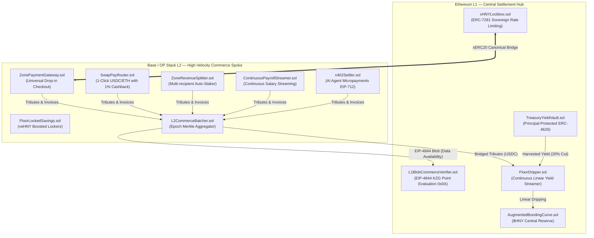

# Economic Zones Protocol ($HNY v2)

> **Autonomous Sovereign Economic Zones with Unbreachable Floor Price, AI Agent Micropayments (x402), SaaS Subscriptions, and Yield-Backed Treasury Bóvedas.**

[](https://book.getfoundry.sh/)
[](https://opensource.org/licenses/MIT)

---

## Architecture Overview

The **Economic Zones Protocol** operates as a sovereign **Hub-and-Spoke** network connecting an Ethereum L1 Central Reserve with high-frequency L2 Execution Rollups (Base / OP Stack) powered by $HNY$.



---

## Core Economic Invariants

### 1. The Mathematical Floor Price
Every minted $HNY$ is backed by real reserve collateral (USDC/WETH). Any holder can redeem their exact proportional share of the reserve at any time with **zero tribute** via `redeemAtFloor()`:

$$\text{Floor Price} = \frac{\text{reserveBalance} \times 10^{18}}{\text{totalSupply}}$$

* **Invariant 1 (Solvency)**: $\text{reserveToken.balanceOf}(\text{curve}) \ge \text{reserveBalance}$
* **Invariant 2 (Strict Monotonic Growth)**: When yield is dripped via [`FloorDripper.sol`](src/rebalancing/FloorDripper.sol) or exit tributes are captured, $\text{Floor Price}_{t+1} > \text{Floor Price}_t$.

### 2. Graduated Dynamic Tributes
Tributes start low to bootstrap organic adoption and scale with TVL:
* **Entry Tribute**: $0.5\% \rightarrow 2.5\%$ (routes to Treasury Vault)
* **Exit Tribute**: $1.0\% \rightarrow 5.0\%$ (routes to Reserve Floor, boosting remaining holders)

---

## Commercial Product Matrix

### 1. "Pay with $HNY$ / USDC" Drop-in Checkout
* [`SwapPayRouter.sol`](src/payments/SwapPayRouter.sol): 1-click execution for users holding USDC or ETH. Automatically buys $HNY$ on the curve, settles the merchant invoice, returns $1\%$ instant cashback to the customer, and captures $1\%$ for the Floor.
* **SDK**: [`@senhor-f/checkout`](pkg/checkout/README.md) for React, Next.js, and Node.js backends.

### 2. SaaS Subscriptions On-Chain
* [`SubscriptionManager.sol`](src/payments/SubscriptionManager.sol): Automated recurring monthly/annual billing for AI APIs, software tools, and newsletter memberships with **recurring monthly cashback**.

### 3. Merchant Revenue Splits & Continuous Payroll
* [`ZoneRevenueSplitter.sol`](src/payments/ZoneRevenueSplitter.sol): Configurable multi-party merchant revenue distribution with auto-staking into $sHNY$ and treasury tax routing.
* [`ContinuousPayrollStreamer.sol`](src/payments/ContinuousPayrollStreamer.sol): Second-by-second salary streaming in $HNY$ for zone workers with real-time tax withholding.

### 4. Liquid Staking ($sHNY$) & veHNY Lockers
* [`StakedHNY.sol`](src/token/StakedHNY.sol): ERC-4626 liquid staking vault autocompounding yields from exit tributes and POL fee harvesting.
* [`FloorLockedSavings.sol`](src/zones/FloorLockedSavings.sol): Time-locked savings providing up to 4x boosted voting power and +100 bps checkout cashback.

### 5. Cross-Chain EIP-4844 Blobs & xERC20 Lockbox
* [`L1BlobCommerceVerifier.sol`](src/crosschain/L1BlobCommerceVerifier.sol): Verifies L2 commercial sales volume on Ethereum L1 using the EIP-4844 KZG Point Evaluation Precompile (`0x0A`).
* [`L2CommerceBatcher.sol`](src/crosschain/L2CommerceBatcher.sol): Aggregates high-frequency L2 commerce volume and routes collected taxes/tributes to L1 Floor Dripper.
* [`xHNYLockbox.sol`](src/crosschain/xHNYLockbox.sol): ERC-7281 sovereign cross-chain custody on L1 with daily rate-limiting to eliminate liquidity fragmentation.

### 6. Fiscal Sovereignty & Multi-Zone Clearing
* [`CustomTariffHook.sol`](src/hooks/CustomTariffHook.sol): Category VAT and cross-zone customs tariffs routed directly to zone treasuries.
* [`ZoneClearingHouse.sol`](src/zones/ZoneClearingHouse.sol): Bilateral net clearing and periodic settlement between sovereign economic zones.

### 7. Autonomous AI Agent Micropayments (HTTP x402)
* [`x402Settler.sol`](src/payments/x402Settler.sol): Native support for **Coinbase AgentKit** and **Claude MCP** servers to settle machine-to-machine API queries in micro-amounts of $HNY$ with EIP-712 signatures.

### 8. Principal-Protected DAO Treasury Bóvedas
* [`TreasuryYieldVault.sol`](src/rebalancing/TreasuryYieldVault.sol): Institutional ERC-4626 vault with **100% principal protection 1:1 in USDC** + 80% interest paid to depositors and 20% floor contribution.

---

## Testing & Verification

The protocol features comprehensive unit tests, invariant fuzzing (32,768 calls per invariant), economic attack simulations (Bank Runs & Flash Loan Sandwiches), and live Base mainnet fork tests:

```bash
# Run entire test suite
make test

# Run unit tests only
make test-unit

# Run invariant fuzzing suite
make test-invariant
```

### Test Suite Summary

```
Ran 41 test suites: 60 passed, 0 failed, 0 skipped (60 total tests)

[PASS] test_VerifyBlobCommerceBatch_AccumulatesVolume (L1BlobCommerceVerifierTest)
[PASS] test_RevertWhen_DoubleVerifyingSameBatch (L1BlobCommerceVerifierTest)
[PASS] test_FinalizeEpochBatch_AndBridgeTributes (L2CommerceBatcherTest)
[PASS] test_Lock_And_UnlockWithinRateLimit (xHNYLockboxTest)
[PASS] test_RevertWhen_DailyRateLimitExceeded (xHNYLockboxTest)
[PASS] test_PackAndUnpackVersion (ProtocolVersionTest)
[PASS] test_Deposit_DistributeRewards_AndRedeemWithYield (StakedHNYTest)
[PASS] test_CreateLock_AndNormalUnlock (FloorLockedSavingsTest)
[PASS] test_EarlyExit_DeductsPenaltyToCurve (FloorLockedSavingsTest)
[PASS] test_ConfigureSplit_AndExecuteWithAutoStake (ZoneRevenueSplitterTest)
[PASS] test_CreateStream_Vesting_AndWithdrawalWithTax (ContinuousPayrollStreamerTest)
[PASS] test_LocalAndCrossZoneTariffAssessment (CustomTariffHookTest)
[PASS] test_CrossZoneBilateralNetting_AndSettlement (ZoneClearingHouseTest)
[PASS] test_SubscribeAndRecurringBillingWithCashback (SubscriptionManagerTest)
[PASS] test_DAODeposit_YieldHarvest_AndFullRedeem (TreasuryYieldVaultTest)
[PASS] test_AgentAutonomousPayment (x402SettlerTest)
[PASS] test_StreamingYieldDripper_IncreasesFloorMonotonically (FloorDripperTest)
[PASS] test_ProofOfCommerceBoostsMatchingShare (PoCRetroPGFPoolTest)
[PASS] test_DepositAndWithdrawAfterCooldown (ProjectCollateralTest)
[PASS] test_SlashInactiveProject_RoutesToTreasury (ProjectCollateralTest)
[PASS] test_AttestCitizenTier (CitizenAttestorTest)
[PASS] test_MilestonePasses_ReleasesTrancheAndRewardsWinners (MilestoneFutarchyTest)
[PASS] test_1Click_SwapAndPayWithCashback (SwapPayRouterTest)
[PASS] test_DepegDetected_TriggerCircuit (OracleCircuitBreakerTest)
[PASS] test_SimultaneousBankRun_PreservesSolvency (BankRunSimulationTest)
[PASS] test_CurvePumpAndDump_AttackerSuffersNetLossDueToTributes (FlashLoanSandwichAttackTest)
[PASS] test_BaseLiveUSDC_BuyAndPayFlow (BaseForkTest)
[PASS] Invariants: Solvency, Supply Conservation & Positive Floor (32,768 calls/inv)
```

---

## Deployment

```bash
# Set environment variables
export PRIVATE_KEY="0x..."
export RPC_URL="https://mainnet.base.org"
export RESERVE_TOKEN="0x833589fCD6eDb6E08f4c7C32D4f71b54bdA02913" # Base USDC

# Run Forge broadcast
forge script script/DeployProduction.s.sol:DeployProduction --rpc-url $RPC_URL --broadcast --verify
```

---

## License
MIT © Economic Zones Protocol
