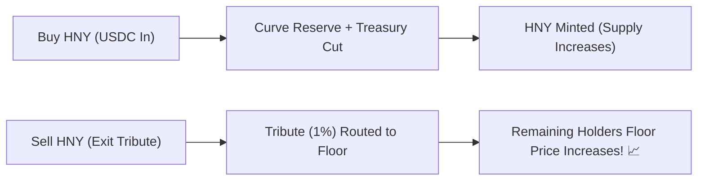

# Augmented Linear Bonding Curve & Floor Invariant

> **Continuous Mathematical Liquidity with Zero-Loss Exit Guarantee**

The core currency of the Economic Zone ($HNY) is minted and burned algorithmically via [`AugmentedBondingCurve.sol`](../../src/curve/AugmentedBondingCurve.sol). Unlike standard AMMs (Uniswap/Curve) that suffer from impermanent loss and liquidity fragmentation, the Augmented Linear Curve provides **continuous programmatic liquidity 24/7** with an **unbreachable mathematical floor price**.

---

## 📐 Mathematical Model

### 1. Spot Price Function
The marginal spot price $P(S)$ for supply $S$ follows an augmented linear equation:

$$P(S) = P_{\text{base}} + m \cdot S$$

Where:
- $P_{\text{base}} = 1.0\text{ USDC}$ (Base floor launch price).
- $m = 10^{-12}$ (Linear slope parameter).
- $S = \text{HNY.totalSupply()}$.

### 2. The Unbreachable Floor Price
Every minted $HNY$ holds an explicit, redeemable right to a proportional fraction of the protocol reserve:

$$\text{Floor Price} = \frac{\text{reserveBalance} \times 10^{18}}{\text{totalSupply}}$$



---

## 🛡️ Solvency Invariants (Formally Verified)

The protocol implements two inviolable mathematical invariants verified by Foundry fuzzing (32,768 calls/inv) and bank run attack suites:

### Invariant 1: Absolute Reserve Solvency
$$\text{reserveToken.balanceOf}(\text{curve}) \ge \text{reserveBalance}$$
The actual token balance in the curve contract must always equal or exceed the internal accounting balance.

### Invariant 2: Non-Decreasing Floor Under Redemptions
$$\forall t_2 > t_1, \quad \text{Floor Price}(t_2) \ge \text{Floor Price}(t_1)$$
Because redemptions via `redeemAtFloor()` burn $HNY$ exactly at the proportional floor price with **zero exit tribute**, the remaining supply and remaining reserve shrink in exact proportion, maintaining the floor price perfectly constant. When redemptions occur via `sellHNY()` or yields are dripped, **the floor strictly increases**.

---

## ⚡ Gas Optimization via Solady & Yul Assembly

Crucial price evaluation and invariant verification functions are implemented in inline Yul assembly for maximum execution speed and zero overflow risk:

```solidity
function getFloorPrice() public view returns (uint256 floor) {
    uint256 supply = hnyToken.totalSupply();
    if (supply == 0) return basePrice;
    uint256 reserve = reserveBalance;
    assembly {
        // floor = (reserve * 1e18) / supply
        floor := div(mul(reserve, 1000000000000000000), supply)
    }
}
```
