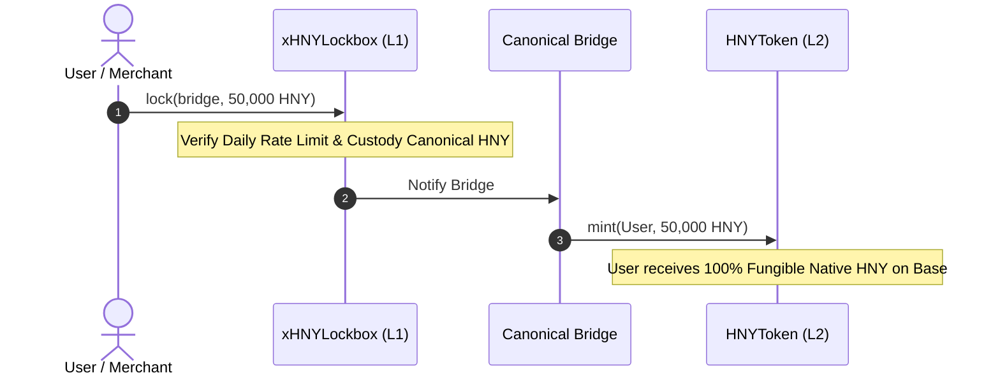

# Cross-Chain EIP-4844 Blobs & xERC20 Sovereign Bridge

> **Trust-Minimized Proof-of-Commerce Verification with EIP-4844 KZG Point Evaluation Precompile (0x0A)**

To enable millions of microtransactions without paying Ethereum L1 gas fees, the protocol uses **EIP-4844 Blobs** for Data Availability and **ERC-7281 (xERC20)** for sovereign asset custody.

---

## 1. EIP-4844 KZG Point Evaluation Precompile (`0x0A`)

High-frequency commercial receipts from Base L2 are aggregated by [`L2CommerceBatcher.sol`](../../src/crosschain/L2CommerceBatcher.sol) and submitted to the Ethereum consensus layer inside an **EIP-4844 Blob**.

[`L1BlobCommerceVerifier.sol`](../../src/crosschain/L1BlobCommerceVerifier.sol) invokes the native Cancun precompile at `0x000000000000000000000000000000000000000A` (`0x0A`):

```solidity
// 192-byte input: versioned_hash (32B) + z (32B) + y (32B) + commitment (48B) + proof (48B)
bytes memory precompileInput = abi.encodePacked(
    versionedHash,
    pointZ,
    valueY,
    commitment,
    proof
);

(bool callOk, bytes memory returnData) = pointEvaluationPrecompile.staticcall(precompileInput);
if (!callOk || returnData.length != 64) revert InvalidKZGProof();
```

### Protocol Advantages:
- **Zero Trusted Oracles**: L1 cryptographically proves that sales occurred on L2 via polynomial commitment openings.
- **Gas Efficiency**: Verification costs a flat **~50,000 gas** on L1 regardless of whether the batch contains 100 or 100,000 invoices.
- **Sybil-Proof Grants**: The RetroPGF pool ([`PoCRetroPGFPool.sol`](../../src/zones/PoCRetroPGFPool.sol)) awards quadratic funding grants only to projects with verifiable blob-proven volume.

---

## 2. Sovereign Cross-Chain Custody ([`xHNYLockbox.sol`](../../src/crosschain/xHNYLockbox.sol))

The token standard follows **ERC-7281 / xERC20**:



### Sovereign Bridge Controls:
- **Bridge Agnosticism**: Governance can authorize multiple bridges (Chainlink CCIP, LayerZero, Connext, Optimism Portal) without minting fragmented wrapped tokens ($W-HNY$).
- **Daily Rate Limiting**: Each bridge adapter has a maximum 24-hour throughput limit. Even under a zero-day exploit of a 3rd-party bridge, protocol treasury loss is hard-capped.
