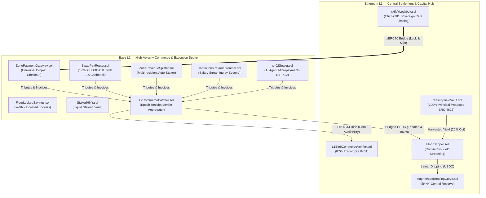

# Architecture Overview

> **A Sovereign Hub-and-Spoke Topology for Web3 Economies**

The **Economic Zones Protocol** decouples high-value monetary reserves from high-frequency commercial execution, creating a zero-compromise architecture where capital security is anchored to Ethereum L1 while frictionless commerce thrives on Layer 2 rollups (Base / OP Stack).

---

## 🏛️ The Three Pillars of Sovereign Zones

### 1. Capital Security & Guaranteed Solvency (Ethereum L1)
All foundational monetary parameters, bonding curve reserves, and institutional treasury assets live on Ethereum L1. Even under total L2 sequencer outages, zero institutional capital is at risk.

### 2. High-Frequency Real Commerce (Base L2)
Sub-cent transactions enable:
- **Instant 1-Click Payments** with automatic customer cashback.
- **Continuous Second-by-Second Payroll** with embedded municipal tax withholding.
- **Machine-to-Machine API Settlements** for autonomous AI agents without human intervention.

### 3. Asymmetric Value Accrual
Every transaction occurring across the spoke networks captures a $1\%$ exit tribute or zone tax in USDC. These funds are bridged to L1 and dripped continuously into the Bonding Curve, **permanently pushing the Floor Price of all $HNY$ holders upward**.
