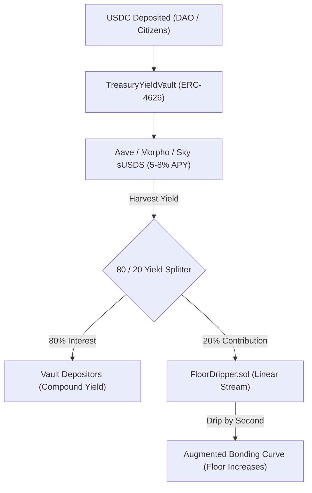

# Treasury Yield Bóvedas & Continuous Floor Dripper

> **Institutional Principal Protection with Continuous Value Streaming**

The protocol deploys capital from entry tributes and DAO treasuries into low-risk fixed income DeFi protocols, harvesting interest and streaming it into the Floor Reserve second-by-second.

---

## 🏦 1. Principal-Protected Treasury Vaults ([`TreasuryYieldVault.sol`](../../src/rebalancing/TreasuryYieldVault.sol))

The `TreasuryYieldVault` is an institutional **ERC-4626 vault** that accepts USDC deposits from DAOs, sovereign zone funds, and enterprise treasuries.

### Key Mechanism:
1. **100% Principal Protection**: Depositors can withdraw their initial USDC principal at any time without impermanent loss or duration risk.
2. **80/20 Yield Split**:
   - **80% of net interest** is paid directly to vault share depositors.
   - **20% of net interest** is routed to the [`FloorDripper.sol`](../../src/rebalancing/FloorDripper.sol) as a public contribution to boost the floor price of the entire zone.

---

## ⏳ 2. Continuous Linear Floor Dripper ([`FloorDripper.sol`](../../src/rebalancing/FloorDripper.sol))

Rather than injecting large lump sums of yield into the bonding curve (which creates sandwich attack vulnerabilities for MEV bots), the `FloorDripper` streams reserve assets **second-by-second**:

$$\text{Drip Amount} = \Delta t \times \text{dripRatePerSecond}$$

### MEV Resistance:
- **No Frontrunning / Sandwiches**: Arbitrageurs cannot pump-and-dump around lump sum rebalances because the yield is injected smoothly with every single block.
- **Monotonic Floor Growth**: Every time `dripToCurve()` is executed (or triggered automatically during checkout), the floor price increases smoothly.

---

## 🌊 3. Protocol-Owned Liquidity (POL) Manager ([`POLManager.sol`](../../src/rebalancing/POLManager.sol))

The `POLManager` deploys secondary AMM liquidity (e.g. Uniswap v3/v4 $HNY$/USDC pool) using protocol reserves:
- Cosechas de comisiones de trading (*trading fees*).
- Quema de $HNY$ del mercado con el $50\%$ de las ganancias.
- Enrutamiento del $50\%$ restante al `FloorDripper`.
