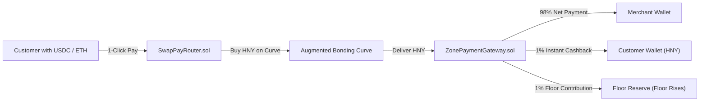

# 1-Click Drop-in Checkout & Instant Cashback

> **Drop-in Web3 Payments with Instant 1% Customer Cashback in $HNY**

The [`SwapPayRouter.sol`](../../src/payments/SwapPayRouter.sol) and [`ZonePaymentGateway.sol`](../../src/payments/ZonePaymentGateway.sol) enable any merchant, SaaS provider, or dApp to accept crypto payments with zero user friction.

---

## ⚡ The 1-Click Payment Pipeline

When a customer pays with USDC or ETH, the router executes the entire sequence atomically in **one single transaction**:



---

## 🎁 The Incentive Flywheel

1. **For the Customer**: Receiving $1\%$ instant cashback in $HNY$ creates an immediate monetary incentive over traditional credit cards (which charge 2.9% + $0.30).
2. **For the Merchant**: Lower fees (1% vs 3%), instant settlement, no chargebacks, and automated tax accounting.
3. **For the Protocol**: Every checkout transaction pushes the floor price higher, rewarding long-term holders.

---

## 💻 Frontend Code Example (React / Wagmi)

```tsx
import { ZoneCheckoutClient } from '@economic-zone/checkout';
import { useWriteContract } from 'wagmi';

const checkout = new ZoneCheckoutClient("0xSwapPayRouterAddress...");

export function CheckoutButton({ projectId, priceUSDC }: { projectId: bigint; priceUSDC: bigint }) {
  const { writeContract } = useWriteContract();

  const handleBuy = () => {
    const tx = checkout.prepare1ClickPayment(
      projectId,
      priceUSDC,
      priceUSDC, // hnyRequired
      50n        // 0.5% max slippage
    );
    writeContract(tx);
  };

  return (
    <button onClick={handleBuy} className="bg-yellow-500 text-black px-6 py-3 rounded-xl font-bold">
      Pay with 1-Click (+1% Cashback in $HNY)
    </button>
  );
}
```
