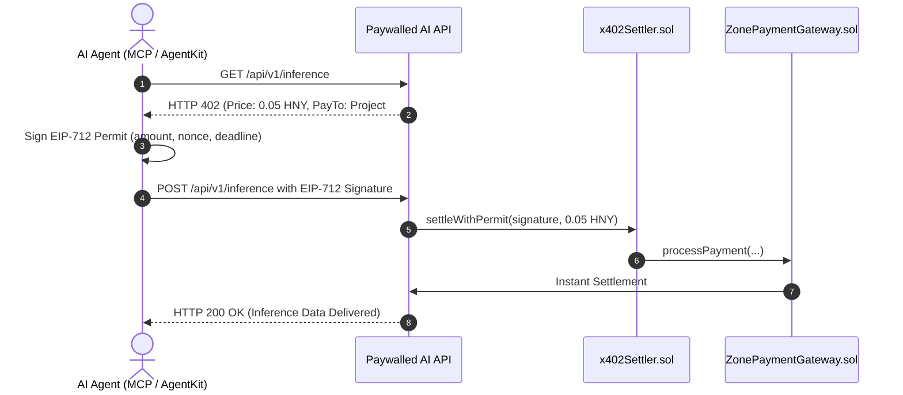

# Autonomous AI Agent Micropayments (HTTP 402)

> **Machine-to-Machine Microtransactions for Coinbase AgentKit and Claude MCP**

The protocol natively implements the `HTTP 402 Payment Required` standard via [`x402Settler.sol`](../../src/payments/x402Settler.sol), allowing autonomous AI agents to query APIs, purchase compute, and settle micro-services using off-chain **EIP-712 cryptographic signatures**.

---

## 🤖 The M2M Settlement Flow



---

## 🔒 EIP-712 Type Definition

```solidity
struct AgentPaymentPermit {
    address agent;
    uint256 projectId;
    uint256 amount;
    uint256 nonce;
    uint256 deadline;
}
```

Because agents sign authorization messages off-chain and the API server submits the settlement transaction, **agents do not need to manage gas balances or execute complex blockchain transactions directly**.
