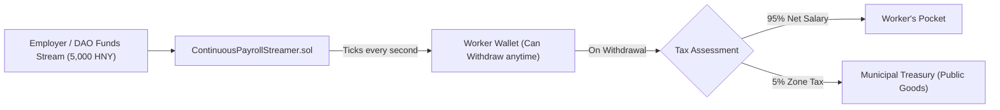

# Continuous Payroll Streaming

> **Second-by-Second Salary Streaming with Automatic Public Goods Tax Withholding**

[`ContinuousPayrollStreamer.sol`](../../src/payments/ContinuousPayrollStreamer.sol) allows employers, DAOs, and zone institutions to stream real-time compensation to contributors and citizens.

---

## ⏱️ Second-by-Second Vesting Formula

For a stream funded with $D$ tokens running from $t_{\text{start}}$ to $t_{\text{stop}}$:

$$\text{Vested}(t) = \begin{cases} 
0 & t \le t_{\text{start}} \\
D \times \frac{t - t_{\text{start}}}{t_{\text{stop}} - t_{\text{start}}} & t_{\text{start}} < t < t_{\text{stop}} \\
D & t \ge t_{\text{stop}}
\end{cases}$$

---

## 🏛️ Embedded Municipal Tax Withholding

When a worker calls `withdrawFromStream(streamId, amount)`:
- The contract automatically calculates `taxAmount = (amount * taxRateBps) / 10000`.
- The tax is transferred directly to the designated `taxCollector` (Zone Treasury).
- The worker receives the remaining balance instantly, with zero paperwork or end-of-year tax debt.
