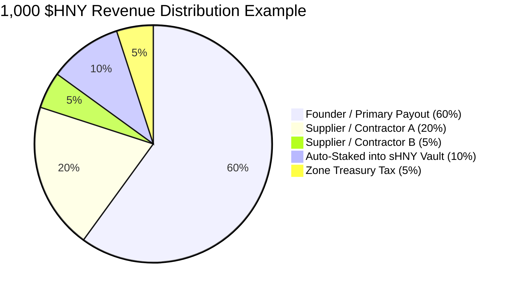

# Merchant Revenue Splits & Auto-Staking

> **Multi-Party Income Routing with Automated Liquid Staking in $sHNY**

[`ZoneRevenueSplitter.sol`](../../src/payments/ZoneRevenueSplitter.sol) eliminates manual bookkeeping and payroll distributions for businesses, DAO working groups, and merchant collectives.

---

## Automated Split Architecture

When a payment of 1,000 $HNY arrives for a registered project:

---

## The Auto-Staking Advantage

Rather than letting working capital sit idle in an operating account:
- Merchants can configure `autoStakeShareBps` (e.g. $10\% = 1000\text{ bps}$).
- The contract automatically deposits that fraction into [`StakedHNY.sol`](../../src/token/StakedHNY.sol).
- The merchant receives autocompounding yield in **$sHNY** generated from protocol exit tributes and POL fee harvests.
