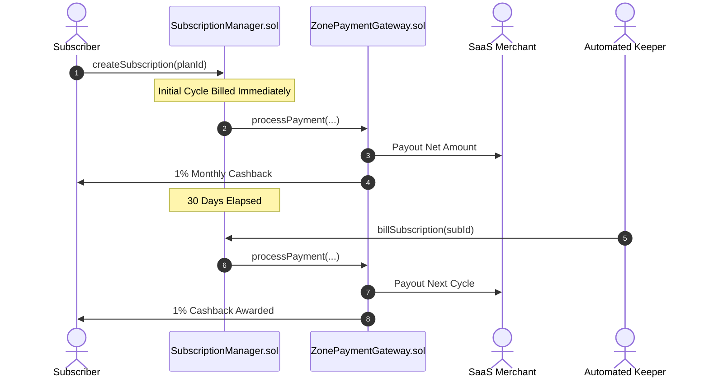

# On-Chain SaaS Subscriptions

> **Automated Recurring Billing with Continuous Customer Rewards**

[`SubscriptionManager.sol`](../../src/payments/SubscriptionManager.sol) provides non-custodial recurring subscription billing for software tools, AI API tiers, media memberships, and creator communities.

---

## 🔄 Subscription Mechanics

1. **Plan Creation**: Merchants define plans with `planId`, `periodSeconds` (e.g. 30 days), and `amountHNY`.
2. **User Authorization**: Subscribers approve the `SubscriptionManager` once via standard ERC-20 permit or approval.
3. **Automated Billing**: Any permissionless keeper or cron bot can call `billSubscription(subscriptionId)` once the billing period elapses.
4. **Recurring Cashback**: With every monthly billing event, the subscriber receives their proportional cashback in $HNY$, increasing long-term user retention.

