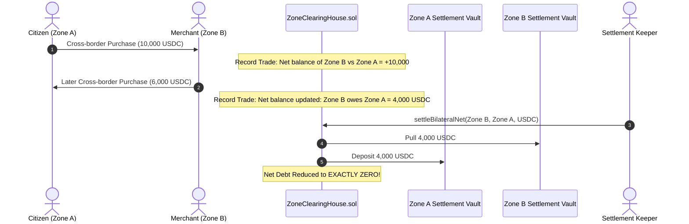

# Sovereign Multi-Zone Clearing House

> **Bilateral Netting Engine & Periodic Settlement Between Economic Zones**

[`ZoneClearingHouse.sol`](../../src/zones/ZoneClearingHouse.sol) provides inter-zone fiscal coordination, allowing multiple sovereign economic zones (e.g. Zone #1: Buenos Aires Tech District, Zone #2: Austin AI Valley, Zone #3: Zug Crypto Valley) to conduct cross-border commerce with **continuous bilateral netting**.

---

## 🌐 The Bilateral Netting Flow

---

## 💡 Gas & Liquidity Advantages

1. **80% Less On-Chain Transactions**: Thousands of bilateral consumer purchases are netted mathematically in storage.
2. **Zero Capital Inefficiencies**: Settlement vaults only need enough reserve to cover the **net imbalance** rather than gross trade volume.
3. **Custom Tariffs Integrated**: Automatically collects cross-border customs tariffs defined in [`CustomTariffHook.sol`](../../src/hooks/CustomTariffHook.sol).
