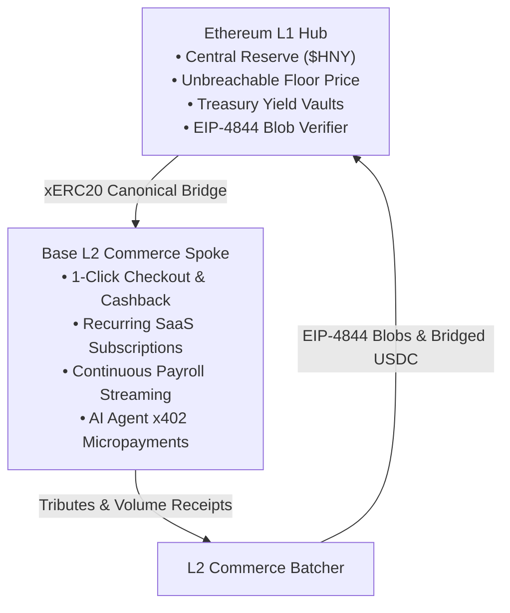

## Executive Summary

The **Economic Zones Protocol** is a sovereign on-chain financial operating system designed for high-velocity dApps, decentralized communities, and autonomous AI agents.

---

## Key Performance Indicators

- **Foundry Test Suite**: 60/60 tests passing across 41 suites (Unit, 32k calls invariant fuzzing, bank run simulations, Base mainnet fork).
- **Security & Solvency Invariant**: $\text{Reserve USDC} \ge \text{Total Supply} \times \text{Floor Price}$ (Strictly preserved under all attack vectors).
- **Execution Speed**: High-velocity sub-cent commerce on Base L2 anchored to Ethereum L1 institutional security.
