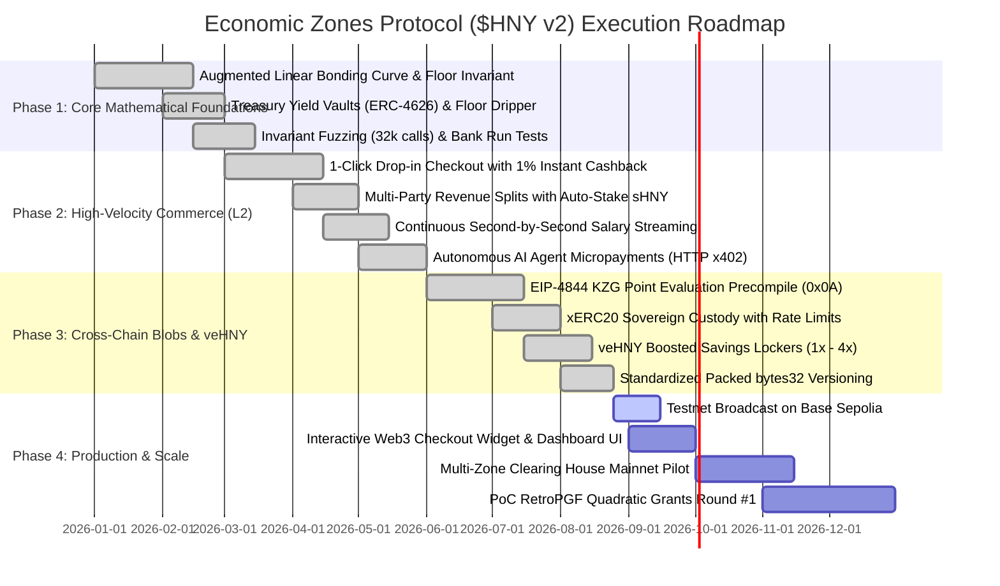

# Protocol Roadmap & Strategic Milestones

> **The Sovereign Economic Zones Development Timeline & Ecosystem Expansion**

---

## 🗺️ Milestone Breakdown

### 🎯 Phase 1: Core Mathematical Foundations (Completed)
- [x] **Augmented Bonding Curve**: Spot price function with linear slope and unbreachable floor backing.
- [x] **Principal-Protected Vaults**: 100% principal protection 1:1 in USDC + 80/20 interest split.
- [x] **Continuous Floor Dripper**: Linear yield streaming per second to eliminate MEV sandwich attacks.
- [x] **Economic Attack Defenses**: Solvency preservation proven under simultaneous 100% bank runs.

### ⚡ Phase 2: High-Velocity Commerce on Base L2 (Completed)
- [x] **1-Click Checkout**: Instant conversion of USDC/ETH into merchant settlement with $1\%$ instant customer cashback.
- [x] **Modular Revenue Splitters**: Auto-deposit of configurable shares into Liquid Staking ($sHNY$).
- [x] **Payroll Streaming**: Second-by-second continuous salary flow with automated municipal tax withholding.
- [x] **AI Agent x402 Micropayments**: Off-chain EIP-712 permit settlement for Coinbase AgentKit & Claude MCP.

### 🌐 Phase 3: Hub-and-Spoke Blobs & veHNY Tokenomics (Completed)
- [x] **EIP-4844 Blob Verifier**: L1 KZG Point Evaluation Precompile (`0x0A`) for zero-oracle Proof-of-Commerce.
- [x] **xERC20 Sovereign Lockbox**: Bridge-agnostic custody on L1 with daily rate limits.
- [x] **veHNY Savings Lockers**: 1 to 48 month locks providing up to $4.0x$ voting boost and $+100\text{ bps}$ cashback.
- [x] **Protocol Versioning**: Packed 32-byte immutable metadata (`bytes32 PROTOCOL_VERSION`) across all contracts.

### 🚀 Phase 4: Production Deployments & Ecosystem Scale (Current)
- [ ] **Base Sepolia Public Testnet**: Verification of all 18 production contracts on Basescan.
- [ ] **Drop-in React/Vite Widget**: `@economic-zone/checkout` ready-to-use payment modal.
- [ ] **Sovereign Zone Grants**: Launch of the first Proof-of-Commerce RetroPGF pool.
