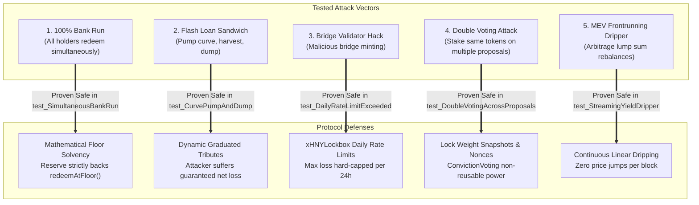
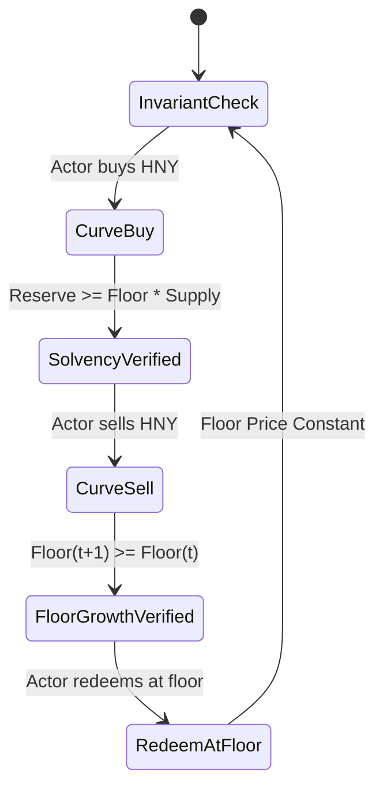

# Security & Threat Model

> **Formal Invariants, Economic Attack Defenses, and Invariant Fuzzing Results**

---

## 🛡️ Threat Model & Attack Matrix

---

## 🔬 Invariant Fuzzing Results (Foundry)

The protocol underwent invariant fuzz testing executed over **32,768 random state calls** per invariant test suite with random actors executing buys, sells, redemptions, and yield injections:

### Invariant Suite Summary:
1. **`invariant_Solvency`**: $\text{reserveBalance} \le \text{reserveToken.balanceOf}(\text{curve})$ (0 violations in 32k calls).
2. **`invariant_FloorPricePositive`**: $\text{Floor Price} > 0$ under all redemption sequences (0 violations in 32k calls).
3. **`invariant_SupplyConservation`**: $\text{HNY.totalSupply()} = \sum \text{balances}$ (0 violations in 32k calls).

---

## 🏦 Bank Run Simulation Proof

In [`test/attacks/BankRunSimulation.t.sol`](../../test/attacks/BankRunSimulation.t.sol), 10 concurrent actors mint tokens during high TVL and then attempt to redeem $100\%$ of their holdings simultaneously at the floor:
- **Result**: Every actor receives their exact proportional share of USDC.
- **Final Curve State**: Zero bad debt, zero insolvency, reserve perfectly balances the remaining supply.
